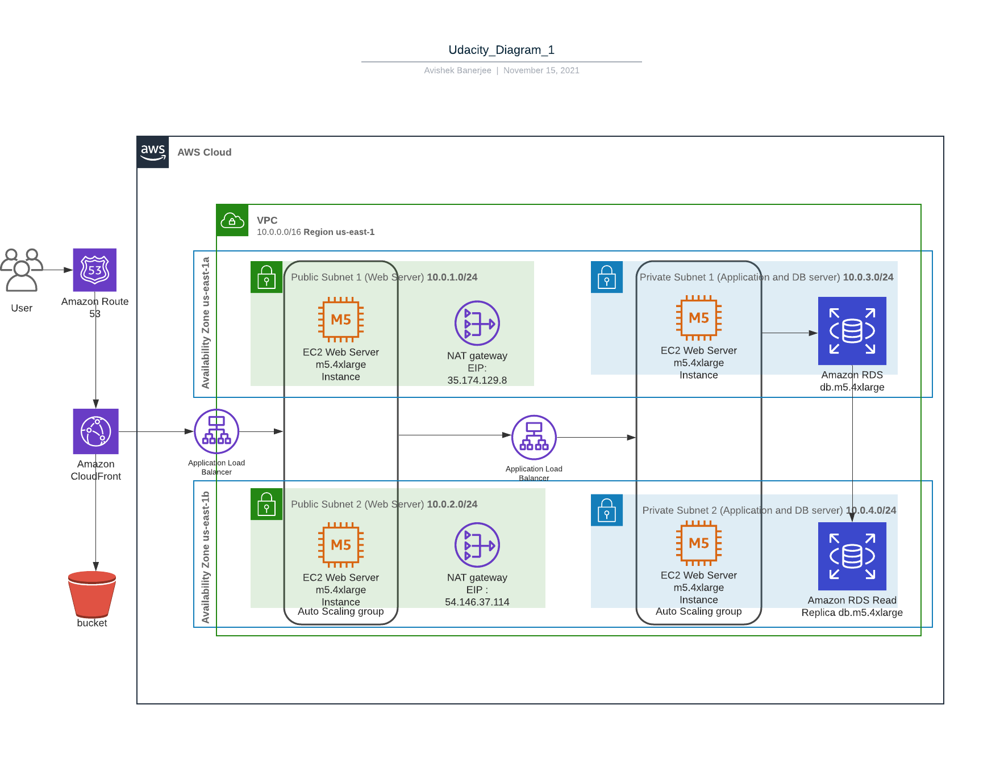
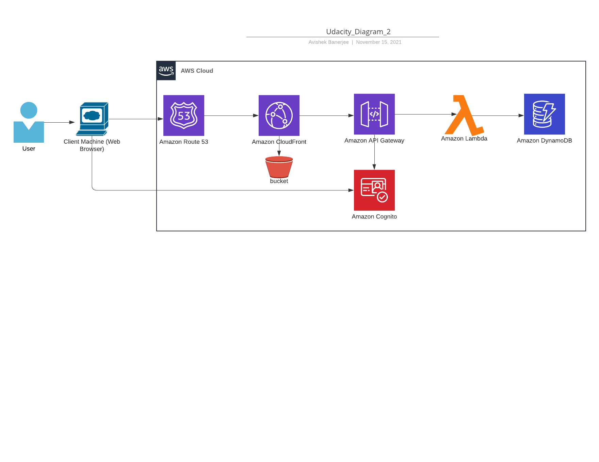
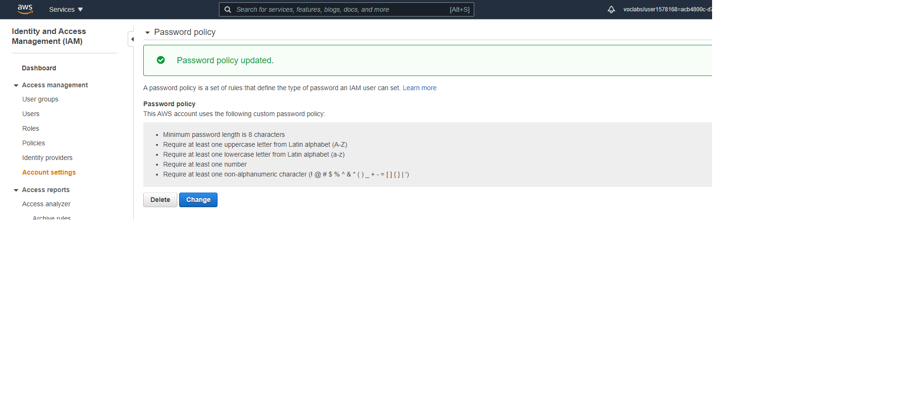
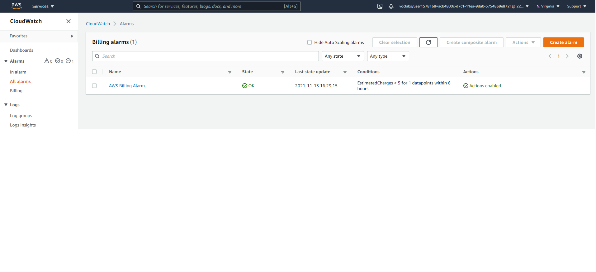
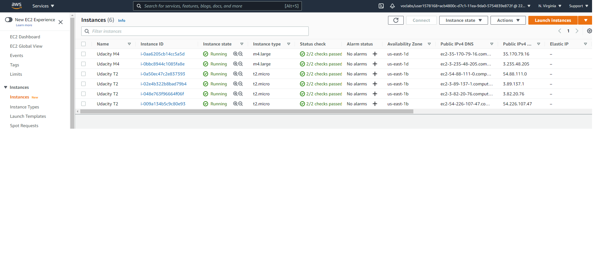
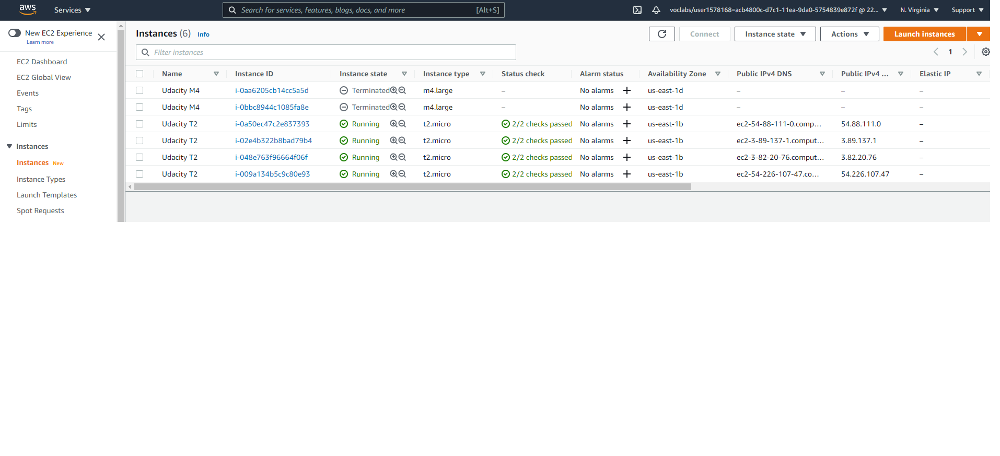
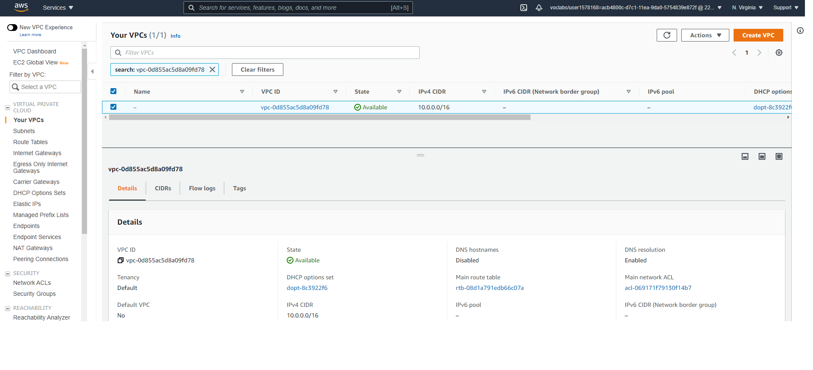
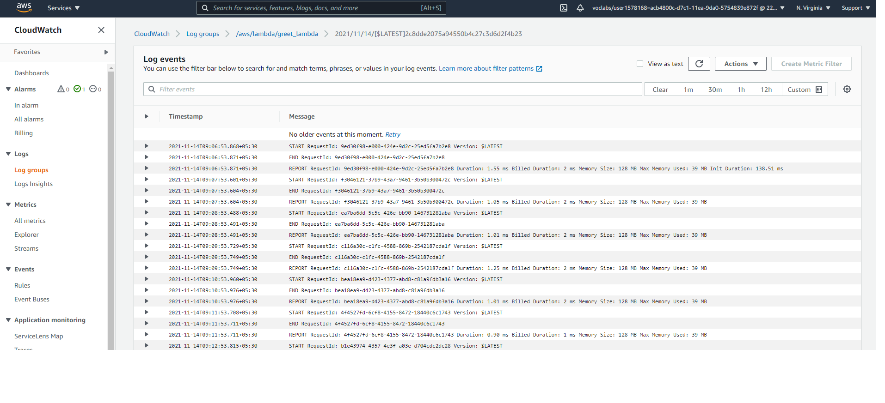
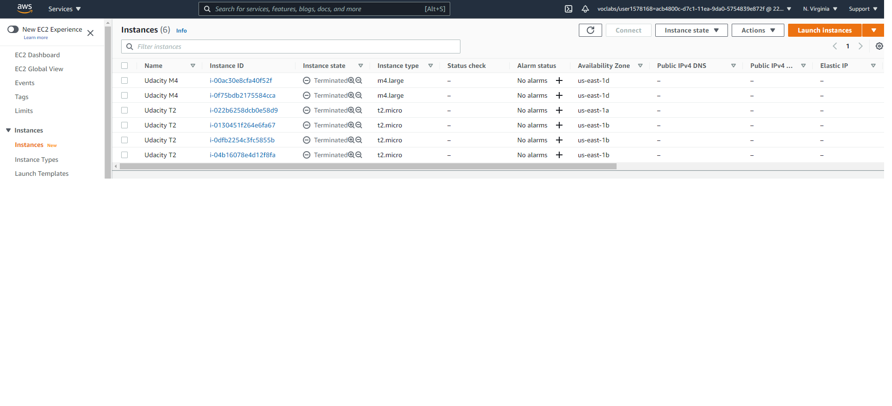

# AWS_Infrastructure_at_Scale
In this project, We will plan, design, provision, and monitor infrastructure in AWS using industry-standard and open source tools.

## Task 1: Create AWS Architecture Schematics
### Part 1

This section is to plan and provision a cost-effective AWS infrastructure for a new social media application development project for 50,000 single-region users. 

To ensure High-Availability, We have added:
- An application load balancer in front of an Auto-Scaling group of multi-AZ EC2 instances to ensure auto failover and support in case of single AZ outage.

To ensure High-Performance, We have added:
- A cross-region Read Replica of RDS to serve the read traffic from the AWS region close to the users
- A CloudFront distribution connected to a S3 bucket that host a static website to the delivery of content at high speed through edge locations.

To ensure Security, We have added:
- A RDS inside private subnets so that it only allows traffic from the load balancers.
- A NAT gateway so that it only allows egress traffic from the private subnet database to download updates and patches.

### Part 2

This section is to plan a SERVERLESS architecture schematic for a new application development project. 

A Serverless architecture is recommended when we don't know the traffic we are expecting for an application and also it provides cost-efficiency as we are not provisioning any infrastructure of our own.
While designing, we have  placed an API Gateway in front of Lambda functions to have a pay per invocation instead of provisioning resources. We have also added Amazon Cognito to manage users.

## Task 2: Calculate Infrastructure Costs

We have calculated the cost on AWS calculator based on the provided scenarios and placed them under Task2 folder (updated)

## Task 3: Configure Permissions

Update the AWS password policy

## Task 4: Set up Cost Monitoring
We have configured CloudWatch billing alarm with a $5 threshold and set up notification to get an email alert when the alarm is triggered by the service

## Task 5 : Use Terraform to Provision AWS Infrastructure
### Part 1
We have deployed 6 EC2 instances (4 AWS t2.micro and 2 m4.large )  with Terraform using main.tf file

We have used Terraform to delete the 2 m4.large instances with Terraform using the main.tf file.

### Part 2
Deploy an AWS Lambda Function using Terraform

Current screenshot of the EC2 instances page

Screenshot of the VPC page

CloudWatch log entry for the lambda function execution

## Task 6: Destroy the Infrastructure using Terraform and prepare for submission
Destroy all running provisioned infrastructure using Terraform

